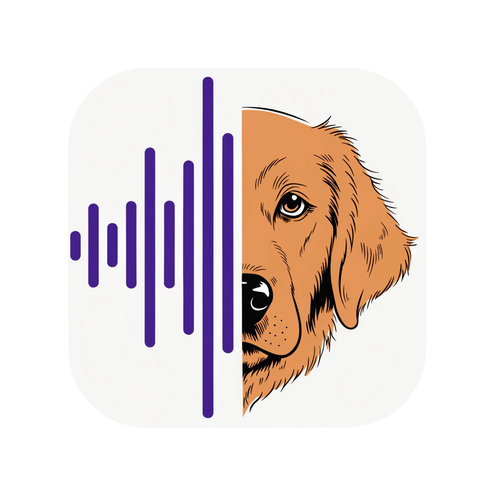

<p align="center">
  
</p>

<h1 align="center">Beamer</h1>

<p align="center">A system-tray dictation app for Windows and Linux.</p>

---

Press a hotkey, speak, and your words appear in whatever text field has focus.
Press a *second* hotkey and they land in a sticky note on the desktop instead,
where two on-device models tidy the transcript and propose action items you
accept or dismiss.

Beamer captures microphone audio, sends it to a cloud speech-to-text API
(ElevenLabs or Mistral Voxtral), and injects the transcript into the active
field through a fallback chain of platform-specific typing backends.
Everything after the transcript — cleanup, task extraction — runs locally
against a llama.cpp server you host yourself.

## Features

- Global hotkey dictation into any focused text field
- A second hotkey for sticky notes, with on-device cleanup and task-suggestion passes
- Fallback injection chain: GNOME virtual keyboard → `wtype` → `ydotool` → clipboard (Linux), UI Automation → `SendInput` (Windows)
- API keys stored in the OS keyring (Secret Service / Credential Manager), never on disk
- Deploy Purple design language

## Platform status

Runs on **Linux (GNOME/Wayland), Windows, and Windows ARM**. Linux is the most
mature target — the GNOME Shell extension covers per-app paste selection, the
recording pill, and sticky-note placement, none of which have a Windows
equivalent yet. There's no release pipeline — build from source. See
`todo.md` for what's open.

## Quick start

**Prerequisites:** GNOME 48–50 on Wayland, [Rust](https://rustup.rs/) stable,
the [Dioxus CLI](https://dioxuslabs.com/learn/0.7/getting_started/) (`cargo
install dioxus-cli`), an API key from [ElevenLabs](https://elevenlabs.io/) or
[Mistral](https://console.mistral.ai/), and a microphone.

```bash
git clone https://github.com/MalakingOso/Beamer.git
cd Beamer
dx build --release
dx run --release
```

A purple tray icon appears. Open **Settings → API Keys** to enter your key,
then hold **Ctrl+Space** in any text field to dictate.

The bundled GNOME extension (per-app paste selection, the recording pill,
note placement) installs itself from **Settings → Injection** — it needs one
log out/in afterward, a Wayland constraint rather than a Beamer one. Beamer
works without it too, falling back through `wtype` → `ydotool` → clipboard.

## Documentation

- `agent_docs/` — per-subsystem deep dives (injection, transcription, audio,
  config, local inference, sticky notes, sync)
- `todo.md` — open work and known gaps
- `docs/decisions.md` — the "why" behind major design decisions

## Credits

On-device transcript cleanup uses [S1-mini](https://huggingface.co/superwhisper/s1-mini)
by Superwhisper, Apache 2.0 with an additional naming term
(`licenses/S1-mini-LICENSE.txt`). Task extraction uses
[K2-Horizon-0.9B](https://huggingface.co/IFM/K2-Horizon-0.9B) by IFM
(`licenses/K2-Horizon-LICENSE.txt` — licence terms unconfirmed, see that
file's provenance note).
