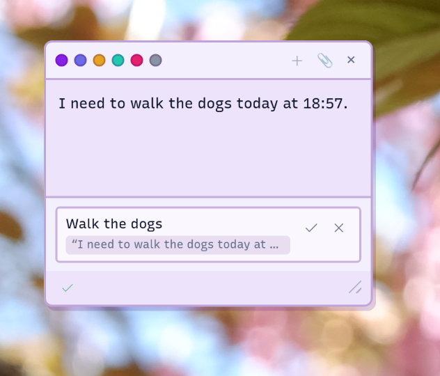

<p align="center">
  
</p>

<h1 align="center">Beamer</h1>

<p align="center">A system-tray dictation app for Windows and Linux.</p>

---

Press a hotkey, speak, and your words appear in whatever text field has focus.
Set a *second* hotkey and they land in a sticky note on the desktop instead,
where on-device models propose action items you accept or dismiss.

Beamer captures microphone audio, sends it to a cloud speech-to-text API
(ElevenLabs or Mistral Voxtral), and injects the transcript into the active
field through a fallback chain of platform-specific typing backends.
Task extraction and STT run locally against a llama.cpp server you host yourself.

## Task extraction

A sticky note doesn't need to be organized to be useful. Talk into one the
way you'd talk to a coworker, half status update, half thinking out loud,
and Beamer reads the note afterward for anything that sounds like a
commitment. Find one, and it proposes a task under the line that produced
it: a short title, a due time if you gave it one, and the exact words it
came from, so you can see why before you accept it.

<p align="center">
  
</p>

Nothing extraction proposes is treated as fact. A task sits there until you
accept or dismiss it, and if a note is just rambling with no commitment in
it, nothing gets proposed at all. Accepted tasks collect on their own page,
grouped by the note that produced them, most recent first, with completed
ones folded away rather than deleted.

<p align="center">
  
</p>

## Features

- Global hotkey dictation into any focused text field
- Second hotkey for sticky notes, with on-device task-suggestion passes
- Fallback injection chain:
  - Linux: GNOME virtual keyboard → `wtype` → `ydotool` → clipboard
  - Windows: `SendInput` → clipboard → UI Automation
- API keys stored in the OS keyring (Secret Service / Credential Manager), never on disk
- Self-update from the tray (Check for Updates)

## Platform status

Runs on **Linux (GNOME/Wayland), Windows, and Windows ARM**. Download pre-built artifacts from the CI workflow on the Actions tab (portable `beamer.exe` + NSIS installer for Windows, `.deb` with `sync_server` for Linux), or use the self-update feature in the tray. Otherwise build from source.

## Quick start

**Prerequisites:** GNOME 48–50 on Wayland, [Rust](https://rustup.rs/) stable,
the [Dioxus CLI](https://dioxuslabs.com/learn/0.7/getting_started/) (`cargo
install dioxus-cli`), an API key from [ElevenLabs](https://elevenlabs.io/) or
[Mistral](https://console.mistral.ai/), and a microphone.

```bash
git clone https://github.com/MalakingOso/Beamer.git
cd Beamer
dx build --release
dx run --release
```

A purple tray icon appears. Open **Settings → API Keys** to enter your key, then set your dictation hotkey in **Settings → Recording**.

Sticky notes are off until you set a second hotkey in **Settings → Recording** (toggle mode: tap once to start, once to stop). Task extraction and STT passes run against a local llama.cpp server — see `deploy/` for the configs Beamer uses.

The GNOME helper extension (direct typing, recording pill, note placement)
installs itself from **Settings → Injection**. Log out and back in after the
first install (a GNOME Wayland constraint). Beamer works without it too,
falling back through `wtype` → `ydotool` → clipboard.

## Documentation

- `roadmap.md` — open work and known gaps

## Credits

- **Gemma 4 E4B** by Google (Apache 2.0) — x86_64 Windows/Linux, [`licenses/gemma-4-LICENSE.txt`](licenses/gemma-4-LICENSE.txt)
- **K2-Horizon-0.9B** by IFM (license terms unconfirmed, see provenance note) — Windows ARM, [`licenses/K2-Horizon-LICENSE.txt`](licenses/K2-Horizon-LICENSE.txt)
