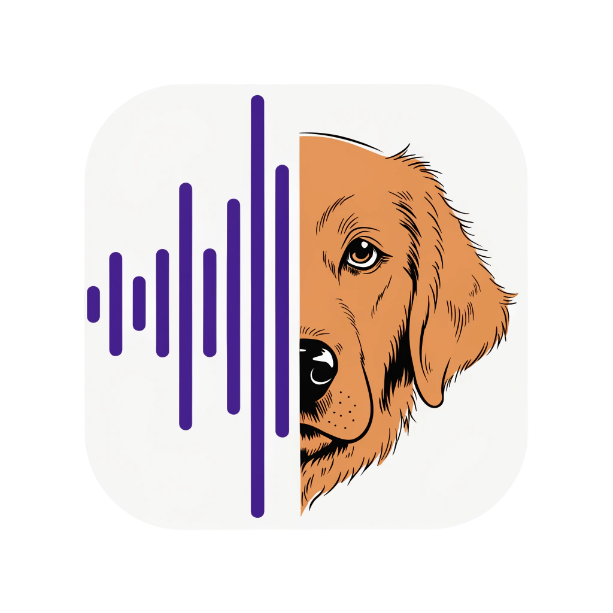
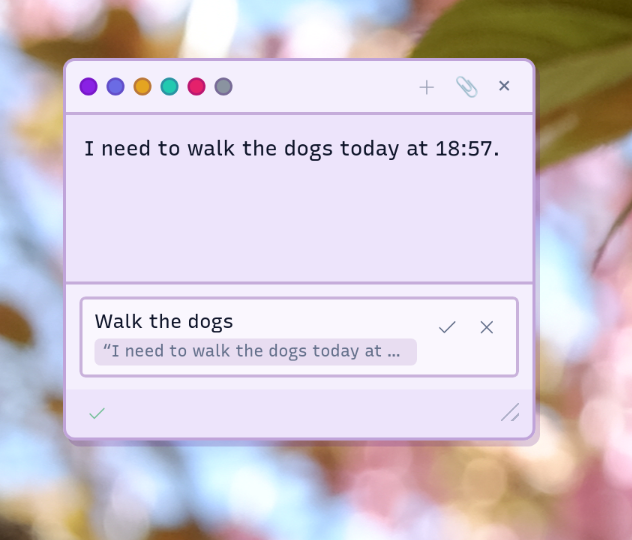
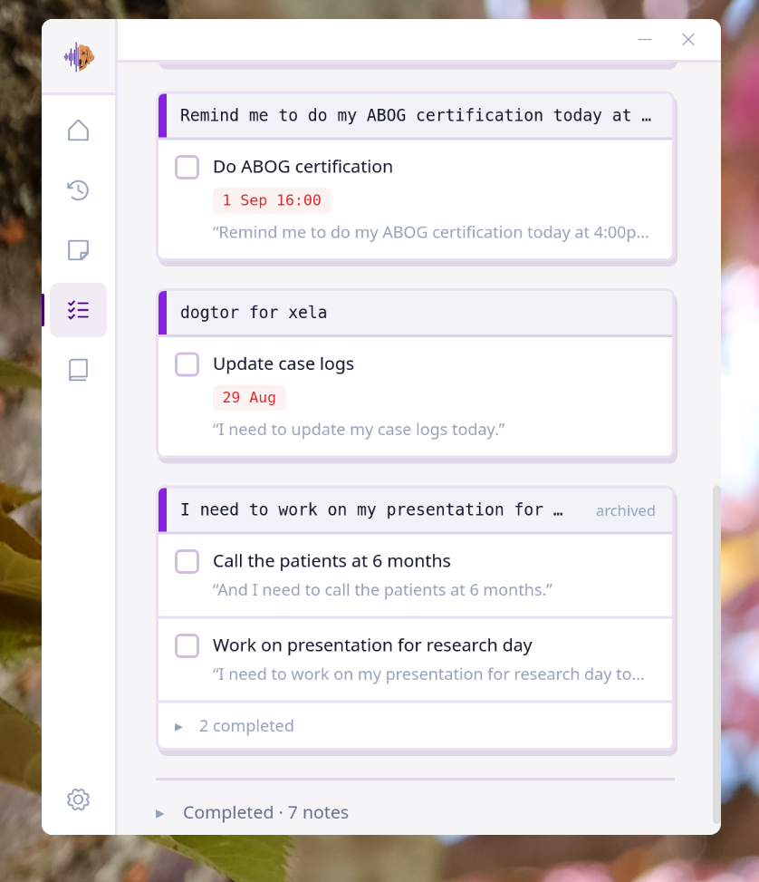
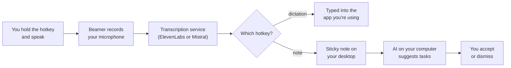

<p align="center">
  
</p>

<h1 align="center">Beamer</h1>

<p align="center">
  <strong>Talk instead of type.</strong><br>
  Hold a key, speak, and your words appear wherever you're typing.
</p>

<p align="center">
  <a href="https://github.com/MalakingOso/Beamer/releases/latest"></a>
  
  
</p>

---

## What is Beamer?

Beamer is a small dictation app that lives in the corner of your screen (the
system tray, next to the clock). It works in almost any program: email,
chat, documents, a web browser, a medical chart.

1. Click into any text box.
2. Hold your hotkey (**Ctrl + Space** by default) and talk.
3. Let go. A moment later your words are typed in for you, with punctuation.

That's it. No window to switch to, no copy and paste.

### Sticky notes that find your to-dos

Set up a second hotkey and your words land on a **sticky note** on your
desktop instead. Talk the way you'd talk to a coworker, half status update
and half thinking out loud. Beamer reads the note afterward and suggests
tasks for anything that sounds like a commitment: *"I need to walk the dogs
at six"* becomes a task, **Walk the dogs**, due at 6 PM.

<p align="center">
  
</p>

Suggestions are only suggestions. Each one shows the exact words it came
from, and nothing is added to your list until you accept it. If a note has
no to-dos in it, Beamer suggests nothing. Accepted tasks collect on their
own page, grouped by the note they came from.

<p align="center">
  
</p>

### Also included

- **Custom vocabulary**: teach Beamer names, drug names, or jargon it keeps getting wrong.
- **History**: your recent dictations are saved, and **Paste Last Transcript** in the tray menu types the last one again.
- **Calendar export**: send a task with a due date to your calendar app in one click.
- **Sync** (optional): keep notes and tasks in step across your computers.
- **Automatic updates**: click **Check for Updates** in the tray menu.

---

## Get started (Windows)

**You'll need:** a Windows PC, a microphone, and an account with
one of the speech-to-text services Beamer uses (see step 3).

### 1. Install

Go to the **[latest release](https://github.com/MalakingOso/Beamer/releases/latest)**
and download the installer:

- **Most PCs:** the file ending in `_x64-setup.exe`
- **Windows on ARM** (Snapdragon laptops, for example): the `aarch64` .zip. Unzip it and run `beamer.exe`.

Run the installer. Windows may show *"Windows protected your PC"* because Beamer isn't
from a big publisher. Click **More info**, then **Run anyway**.

### 2. Find the tray icon

After it starts, a purple Beamer icon appears in the system tray by the
clock. It may be hidden behind the **^** arrow. Click the icon to open the
menu.

### 3. Get a speech-to-text key

Beamer doesn't turn speech into text by itself. It sends your recording to
a transcription service, and that service needs to know it's you. You
prove that with an **API key**, a long password you copy from your
account. You only do this once.

Pick one:

| Service | Good for | Where to get a key |
|---|---|---|
| **ElevenLabs** (recommended) | Everyday dictation. There's also a **Medical** mode tuned for clinical terms. | Sign up at [elevenlabs.io](https://elevenlabs.io/), then find **API Keys** in your account settings and create one. |
| **Mistral (Voxtral)** | An alternative; detects your language automatically. | Sign up at [console.mistral.ai](https://console.mistral.ai/), then open **API Keys** and create one. |

These services charge for usage (some have free allowances). Check their
pricing pages.

### 4. Paste the key into Beamer

Tray icon → **Settings** → **API Keys**. Paste your key into the box for
the service you chose. Then, under **Transcription**, choose that same
service as the **Backend**.

### 5. Try it

Click into any text box (Notepad works well for a first try), hold
**Ctrl + Space**, say a sentence, and let go.

To change the hotkey, or switch from *hold to talk* to *tap to start / tap
to stop*, go to **Settings → Recording**.

### 6. Turn on sticky notes (optional)

In **Settings → Recording**, set a **note hotkey**. It's off until you pick
one, so Beamer never takes over a shortcut another app uses. Tap it once to
start a note and again to finish.

Task suggestions need a small AI model that runs on your own computer:

- **Windows on ARM:** Beamer sets this up for you. The first time it
  starts, it downloads about 1.1 GB in the background. You can watch the
  progress in **Settings → Local AI**.
- **Other PCs:** your sticky notes work, but task suggestions need a local
  AI server that you run yourself. This is a technical setup; see
  [For developers](#for-developers).

---

## How it works


```mermaid
flowchart LR
    A["You hold the hotkey<br/>and speak"] --> B["Beamer records<br/>your microphone"]
    B --> C["Transcription service<br/>(ElevenLabs or Mistral)"]
    C --> D{"Which hotkey?"}
    D -- dictation --> E["Typed into the<br/>app you're using"]
    D -- note --> F["Sticky note on<br/>your desktop"]
    F --> G["AI on your computer<br/>suggests tasks"]
    G --> H["You accept<br/>or dismiss"]
```

Some apps block one way of typing text or another, so Beamer tries several
in turn: simulated keystrokes, a quick paste (your clipboard is put back
afterwards), and accessibility controls. If text still goes missing, **Paste
Last Transcript** in the tray menu brings it back.

## Your privacy: what leaves your computer

- **Your voice recording** goes to the transcription service you picked
  (ElevenLabs or Mistral) and nowhere else. Their privacy policies apply to
  it.
- **Your API keys** are kept in Windows Credential Manager (on Linux, the
  system keyring), not in a plain file.
- **Your notes and tasks** stay on your computer. Task suggestions are
  made by a model on your own machine, not in the cloud.
- **Sync** is off by default. If you turn it on, notes go only to a sync
  server that you run.

## Troubleshooting

**Nothing happens when I press the hotkey.** Check the tray icon. If it's
missing, start Beamer from the Start menu. Another app may already use
Ctrl + Space (some keyboard-language switchers do). Pick a different
hotkey in **Settings → Recording**.

**It recorded, but no text appeared.** Make sure a text box had focus
(click into it first). Try **Paste Last Transcript** from the tray menu.
If that's empty too, check your key under **Settings → API Keys**.

**Words it keeps getting wrong.** Add them from the tray menu under
**Vocab**.

**Something else.** **Settings → Debug** shows a log of what Beamer has
been doing, which helps when you
[open an issue](https://github.com/MalakingOso/Beamer/issues).

---

## Linux

Beamer also runs on Linux with **GNOME 48–50 on Wayland**. A `.deb`
package is on the [releases page](https://github.com/MalakingOso/Beamer/releases/latest).
For the best typing support, install the small GNOME helper from
**Settings → Text Injection**, then log out and back in once. Without it,
Beamer falls back to `wtype`, then `ydotool`, then the clipboard. On Linux,
task suggestions need your own [llama.cpp](https://github.com/ggml-org/llama.cpp)
server; `deploy/` has the configs Beamer expects.

## For developers

Beamer is written in Rust with [Dioxus](https://dioxuslabs.com/) 0.7.

```bash
cargo install dioxus-cli
git clone https://github.com/MalakingOso/Beamer.git
cd Beamer
dx serve                      # run with hot reload
dx build --release            # release build (use this to test typing into apps)
cargo test                    # CI runs this with RUSTFLAGS="-D warnings"
```

Where to read next:

- **`src/main.rs`**: the top-of-file comment is a map of the codebase,
  covering the dictation path and the notes path module by module.
- **[`CLAUDE.md`](CLAUDE.md)**: project layout, commands, and code rules.
- **[`agent_docs/`](agent_docs/)**: deep dives on each subsystem (text
  injection, audio, transcription, sticky notes, local AI, sync).
- **[`docs/decisions.md`](docs/decisions.md)**: why major features work the way they do.
- **[`roadmap.md`](roadmap.md)**: known issues and open work.

## Credits

Task suggestions use open models:

- **Gemma 4 E4B** by Google (Apache 2.0), used on x64 Windows and Linux. See [`licenses/gemma-4-LICENSE.txt`](licenses/gemma-4-LICENSE.txt).
- **K2-Horizon-0.9B** by IFM, used on Windows on ARM (license terms unconfirmed; see the provenance note). See [`licenses/K2-Horizon-LICENSE.txt`](licenses/K2-Horizon-LICENSE.txt).
